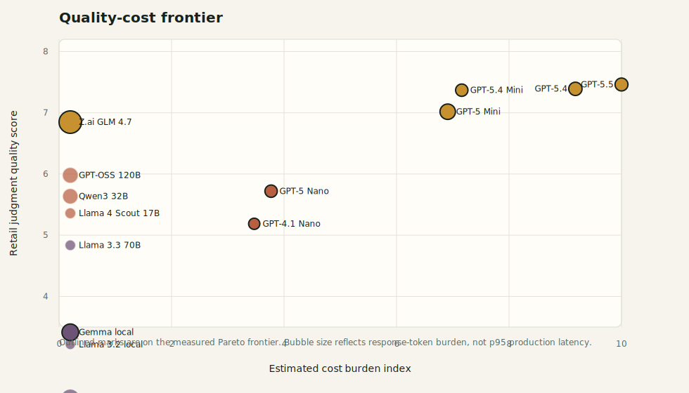
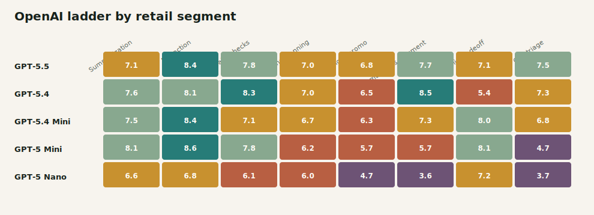
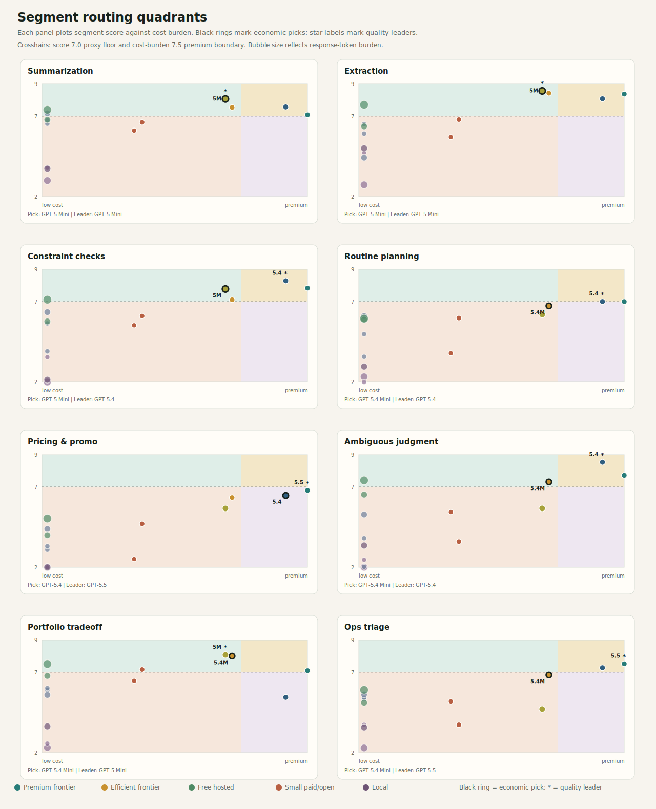

# Retail MerchBench

[](https://github.com/Novice-ninja/retail-merchbench/actions/workflows/validate.yml)
[](LICENSE.md)
[](LICENSE.md)
[](eval_packs/)
[](reports/eval_packs/)

**An eval framework to identify which model is economically right for each retail decision.**

> Fork it, run your favorite model, open a PR, or challenge the scorer.

Retail MerchBench is a retail AI benchmark and model-routing toolkit for merchandise-planning workflows. It evaluates whether a model is **economically sufficient** for a task once quality, latency, inference cost, downside risk, reversibility, deterministic controls, and human review are considered.

This repo is built for teams deploying LLMs into retail planning, merchandising, pricing, allocation, replenishment, and exception-management workflows.

## Read This First

- **Paper PDF:** [paper/retail_merchbench.pdf](paper/retail_merchbench.pdf)
- **Paper source:** [paper/retail_merchbench.tex](paper/retail_merchbench.tex)
- **Visual Atlas:** [reports/atlas/index.html](reports/atlas/index.html)
- **Written Atlas:** [reports/atlas/report.md](reports/atlas/report.md)
- **Launch guide:** [docs/LAUNCH.md](docs/LAUNCH.md)
- **Methodology:** [docs/METHODOLOGY.md](docs/METHODOLOGY.md)
- **Reproducibility:** [docs/REPRODUCIBILITY.md](docs/REPRODUCIBILITY.md)

If this project helps your evals, model-routing strategy, or AI roadmap, star the repo so more retail AI teams can find it.

For retail AI, the winning model is not always the strongest model. It is the cheapest safe workflow that clears the quality floor, escalates the right cases, and preserves human judgment where automation remains risky.

## Why This Exists

Retail teams are about to put LLM calls inside every planning workflow:

- vendor note summaries;
- cost and receipt extraction;
- OTB, MOQ, pack, margin, and capacity checks;
- replenishment and allocation recommendations;
- price-match and promotion decisions;
- ambiguous chase-order calls;
- cross-category portfolio tradeoffs;
- store and customer-trust triage.

Most evals tell you whether a model can answer a prompt. Retail operators need a harder answer:

> Should this workflow use rules, a small model, a mid-tier model, a frontier model, a cascade, or human review?

Retail MerchBench is designed around that economic routing question.

## Current Evidence Package

| Asset | What is included |
| :--- | :--- |
| Eval corpus | 100 retail-native segment eval items across eight workflow classes |
| Model panel | 14 real models with full scored coverage in the curated artifact set |
| Providers | OpenAI, Cerebras, Groq, and local Ollama artifacts |
| Baselines | Deterministic adversarial baselines for scorer sanity checks |
| Atlas | Cost-quality frontier, segment heatmap, 2x2 routing quadrants, routing ladder, economic-regret chart |
| Paper | Full LaTeX paper plus committed PDF |
| Runner | Provider-agnostic runner and stored-response scorer |
| Human calibration | Blind subset, rating form, and protocol scaffolding |

## Headline Findings

- `openai/gpt-5.5` is the overall quality leader in the stored run.
- `openai/gpt-5.4-mini` is the broad economic default: near-frontier quality at materially lower observed artifact cost.
- `openai/gpt-5-mini` is the strongest cheap paid specialist for summarization, structured extraction, and portfolio triage.
- `cerebras/zai-glm-4.7` is the strongest free hosted comparator in the current artifact set.
- Pricing and promotion, routine planning, portfolio tradeoff, and high-risk operational triage still require deterministic controls or human review.

These are automated routing priors, not final human-validated production recommendations.

## Visual Preview

### Cost-Quality Frontier



### Segment Heatmap



### Routing Quadrants



## Decision Segments

| Segment | What it tests | Routing implication |
| :--- | :--- | :--- |
| Low-risk summarization | Source fidelity, numeric preservation, caveats | Cheap models can work if they do not invent decisions |
| Structured extraction | Exact fields, missing values, schema compliance | Rules first; model fallback for messy text |
| Constraint checking | OTB, MOQ, pack, margin, capacity, policy | Deterministic gates should remain authoritative |
| Routine planning recommendation | Bounded replenishment, markdown, allocation actions | Mid-tier model plus controls |
| Pricing and promotion | Margin, funding, supply, competitor response, pull-forward | Human review for material price moves |
| Ambiguous planning judgment | Contaminated evidence, causal reframing, uncertainty | Stronger model plus escalation |
| Portfolio tradeoff | Cross-category OTB, opportunity cost, leadership pressure | Human review even when model score is high |
| Operational triage | Safety, customer promise, capacity, owner routing | Cascade with safety and legal gates |

## Quickstart

Use Python 3.11 or newer.

```bash
git clone https://github.com/Novice-ninja/retail-merchbench.git
cd retail-merchbench
python3 -m venv .venv
source .venv/bin/activate
pip install -r requirements.txt
make validate
```

## Offline Reproduction

This rebuilds deterministic baselines, re-scores stored model responses, regenerates routing recommendations, publication metrics, the visual Atlas, and validation checks. It does not call model providers.

```bash
make reproduce
```

Open:

- [reports/atlas/index.html](reports/atlas/index.html)
- [reports/atlas/report.md](reports/atlas/report.md)
- [paper/retail_merchbench.pdf](paper/retail_merchbench.pdf)

## Run a New Model

Copy the public environment template and add only the provider keys you need:

```bash
cp .env.example .env.local
```

Small smoke test:

```bash
python3 -m merchbench.cli eval-pack-provider \
  --provider openai \
  --models gpt-4.1-nano \
  --items-per-pack 1 \
  --resume
```

Memory-conscious local Ollama run:

```bash
python3 -m merchbench.cli eval-pack-provider \
  --provider ollama \
  --models llama3.2:3b \
  --unload-after-item \
  --resume
```

Score an existing response artifact:

```bash
python3 -m merchbench.cli eval-pack-score \
  --responses path/to/model_responses.json \
  --output-scores reports/eval_packs/model_scores.json \
  --output-summary reports/eval_packs/model_summary.md
```

## Repository Map

| Path | Purpose |
| :--- | :--- |
| `eval_packs/` | Source 100-item retail eval corpus. |
| `merchbench/` | Scoring, provider runner, routing, and I/O library code. |
| `analysis/` | Artifact generation, rescoring, routing reports, and publication metrics. |
| `reports/atlas/` | Public visual Atlas and written report. |
| `reports/eval_packs/` | Stored model responses, scores, summaries, and scorer robustness report. |
| `reports/publication_metrics/` | Risk-weighted and cost-normalized metrics. |
| `reports/routing/` | Segment-level routing recommendations. |
| `paper/` | PDF and LaTeX research paper. |
| `docs/` | Methodology, data card, reproducibility, provider runner, launch kit, and human-rater protocol. |
| `human_validation/` | Blind subset and rating-form scaffolding. |
| `routing/` | Segment policies, model profiles, and provider registry. |
| `schema/` | Eval-pack JSON schema. |
| `tests/` | Unit tests for scoring behavior. |

## Help Make This Better

Useful contributions:

- run a new model and open a PR with stored response and score artifacts;
- add retail-native eval items from grocery, apparel, marketplace, beauty, hardlines, pharmacy, or specialty retail;
- improve scorer calibration against human retail practitioners;
- contribute latency and retry measurements;
- challenge the methodology with a concrete failure case.

Open an issue with a retail workflow you want covered, or submit a model run using the stored-response format.

**Start here:** Fork it, run your favorite model, open a PR, or challenge the scorer.

## Interpretation Boundary

Retail MerchBench is designed to support model-routing decisions. It should be treated as:

- a public methodology and artifact package;
- a benchmark corpus for retail-specific judgment;
- a routing-prior generator for model, rules, cascade, and human-review workflow design.

It should not be treated as:

- a universal model leaderboard;
- a retailer-specific cost model;
- proof of autonomous readiness for pricing, portfolio, safety, legal, or executive override decisions.

## Keywords

Retail AI, LLM evals, model routing, AI agents, merchandise planning, retail analytics, pricing AI, replenishment AI, allocation AI, LLMOps, benchmark, evaluation harness, OpenAI evals, Ollama evals, Groq evals, Cerebras evals, human-in-the-loop AI.

## License

Code is released under the MIT License. Benchmark data, paper text, and reports are released under CC BY 4.0 unless otherwise noted.
